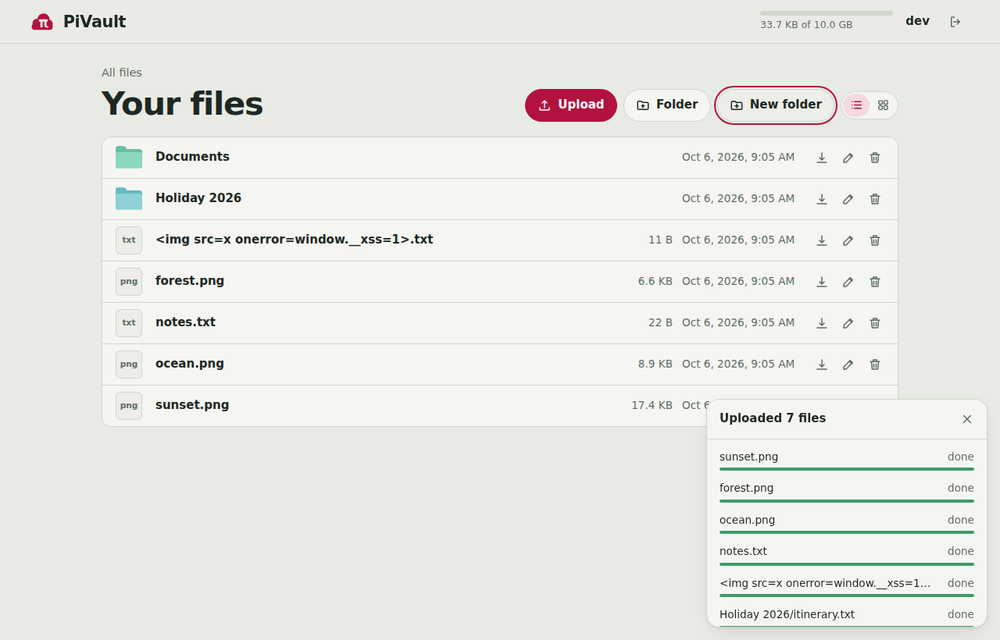
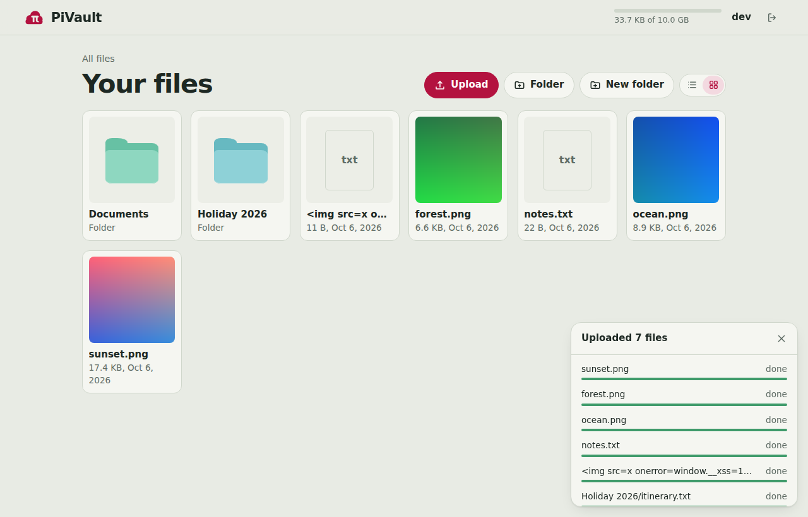
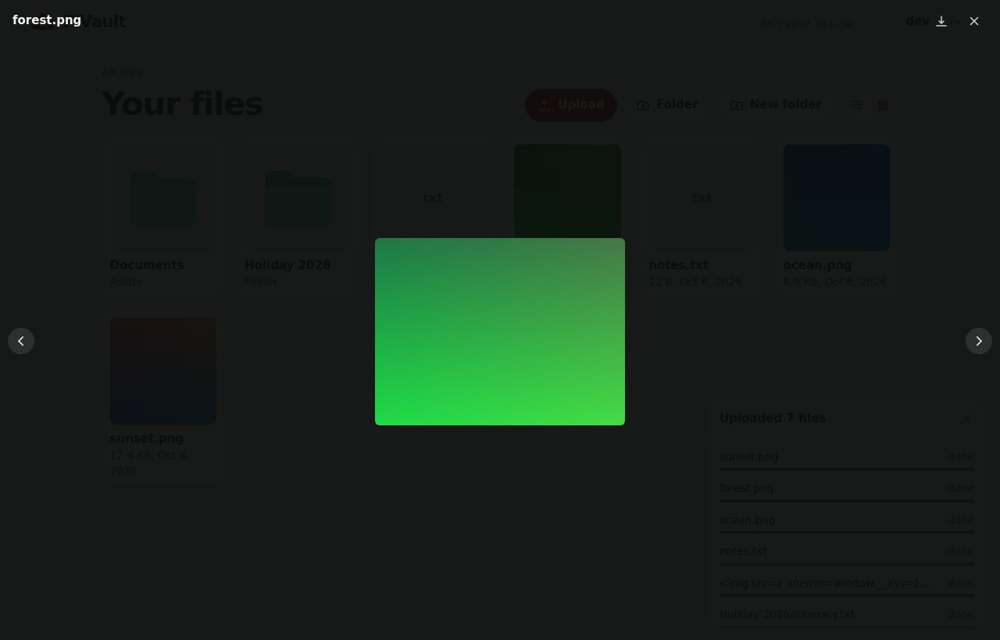
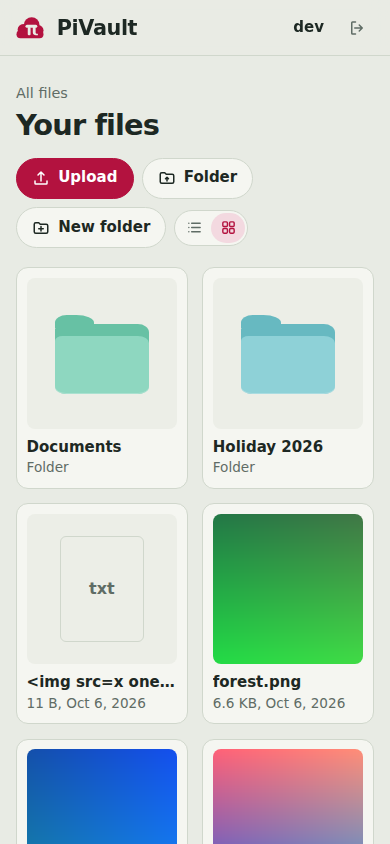
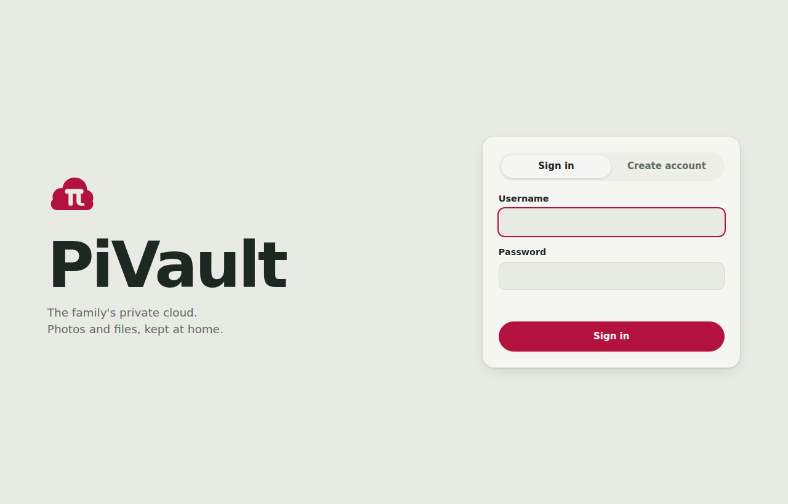
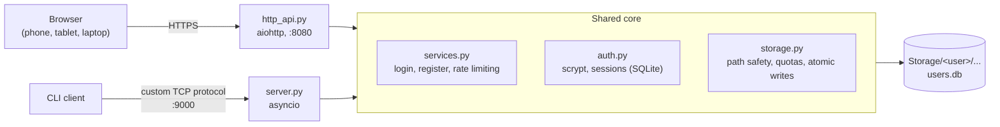

<p align="center"></p>

# PiVault

**A private, self-hosted cloud storage server for your family, written from scratch in Python and designed to run on a Raspberry Pi.**

Every family member gets their own account and their own private folder. Files are uploaded, browsed, previewed and downloaded through a web app that works on phones, tablets and laptops, with no app store, no third-party cloud and no web framework doing the thinking for me. Authentication, storage, the wire protocol and the security model are all hand-built and covered by an automated test suite.

<table>
  <tr>
    <td></td>
    <td></td>
  </tr>
  <tr>
    <td></td>
    <td align="center"> </td>
  </tr>
</table>

## Features

- **Accounts:** register and sign in with a username and password. Registration is gated by a family invite code.
- **Private folders:** each user's files live in `Storage/<username>/`, and users can never see each other's data.
- **Web app:** plain HTML, CSS and JavaScript with no build step. List and grid views, breadcrumbs, working back button, and installable to the home screen.
- **Uploads:** drag-and-drop or pick files, or whole folders. Three upload in parallel with per-file progress.
- **Viewer:** images, video and audio play in-browser, with arrow-key navigation and video seeking.
- **Manage:** create folders, rename, delete, and download any folder as a streamed `.zip`.
- **Large files:** uploads and downloads are streamed in 64 KB chunks and never loaded into RAM, which matters on a Pi. Writes are atomic, so a dropped connection never leaves a half-written file.
- **Quotas:** a per-user storage limit (10 GB by default).
- **Two interfaces, one core:** the web app and a custom length-prefixed TCP protocol (with a CLI client) share the same account, storage and security code.

## Architecture



The security-critical logic lives once, in the shared core. The two front ends only translate requests, so a fix in one place protects both.

## Design decisions and what I learned

I started with a plain TCP server and grew it into a web app, and most of the useful lessons came from the choices that held up and the ones I had to revise.

- **A length-prefixed protocol, not `service:action:arg` text.** TCP is a byte stream with no message boundaries, and a text format breaks as soon as a file name contains a `:` and can't carry binary data. A fixed-size prefix lets me enforce size limits *before* reading anything and stream large files in chunks.
- **No home-made cryptography.** Inventing a protocol means inventing its authentication too, which is where homemade systems usually fail. So the protocol rides inside TLS (or a private Tailscale network) and passwords use standard scrypt, and my own code is limited to the parts that are specific to this app.
- **A shared core instead of two servers.** When the browser needed to be a client, I pulled accounts, storage and rate limiting into modules that both the TCP server and the HTTP API call. Browsers can't open raw TCP sockets, so reusing the CLI client would have meant a gateway with its own sessions. With a shared core, a security fix lands once and protects both, and a test confirms a file uploaded in the browser appears in the CLI.
- **Uploaded files are an attack surface.** In a web app, a file someone uploads is served from the site's own origin, so a stray `.html` or `.svg` could run script as a logged-in user. That's why only a whitelist of media types is shown inline, everything else is forced to download in a sandbox, and file names are only ever rendered as text.
- **Tests that attack my own code.** The suite includes path-traversal attempts, hostile file names, forged headers and a replayed login cookie. The browser tests also caught real bugs the API tests couldn't, such as a long file name stretching the grid layout and the Enter key cancelling a dialog.
- **Built for a small device.** Streaming in 64 KB chunks, atomic writes through a temporary file, and a plain HTML/CSS/JS front end with no build step all came from running on a Raspberry Pi with limited memory and an SD card.

## Quick start

Requires Python 3.9 or newer. The TCP server and CLI use only the standard library, and the web UI needs `aiohttp`.

```bash
pip install -r requirements.txt

python server/server.py --invite-code "choose-a-family-secret"
# web app: http://localhost:8080      TCP protocol: localhost:9000
```

Open <http://localhost:8080>, choose **Create account**, enter your invite code, and you're in.

On Windows, if `py` and `pip` disagree about which Python they use, run `py -m pip install -r requirements.txt` and start the server with the same `py`.

### Command-line client

```bash
python client/client.py
pivault[guest]> register
pivault[alice]> mkdir photos
pivault[alice]> put ./holiday photos/     # uploads a file or a whole folder
pivault[alice]> ls photos
pivault[alice]> get photos                # downloads a file or a whole folder
```

### Options

| Flag | Default | Meaning |
|---|---|---|
| `--host` | `127.0.0.1` | Address for the TCP server. Localhost only unless you change it. |
| `--port` | `9000` | TCP protocol port |
| `--web-port` | `8080` | Web app port (`0` disables the web app) |
| `--web-host` | same as `--host` | Address for the web app |
| `--data-dir` | `./data` | Where `Storage/` and `users.db` live |
| `--invite-code` | none | Required to register (or set `PIVAULT_INVITE_CODE`) |
| `--quota-mb` | `10240` | Per-user storage limit |
| `--cert`, `--key` | none | Enable TLS (PEM files) |

The server warns at startup if it is exposed without TLS or without an invite code.

## Deploying on a Raspberry Pi

The recommended setup keeps the server **private**: it listens only on localhost and is published to your own devices through [Tailscale](https://tailscale.com), which supplies HTTPS and ensures nothing is exposed to the public internet.

```bash
# on the Pi
curl -fsSL https://tailscale.com/install.sh | sh
sudo tailscale up
python3 -m venv /opt/pivault/venv && /opt/pivault/venv/bin/pip install -r requirements.txt
/opt/pivault/venv/bin/python server/server.py --data-dir /var/lib/pivault &
sudo tailscale serve --bg 8080        # https://<pi-name>.<tailnet>.ts.net, tailnet-only
```

In the Tailscale admin console, enable MagicDNS and HTTPS certificates first. Do **not** use `tailscale funnel`, which publishes to the whole internet.

An example systemd unit that runs it as an unprivileged, sandboxed service:

```ini
# /etc/systemd/system/pivault.service
[Unit]
Description=PiVault
After=network-online.target

[Service]
User=pivault
# /etc/pivault.env contains one line:  PIVAULT_INVITE_CODE=your-secret
EnvironmentFile=/etc/pivault.env
ExecStart=/opt/pivault/venv/bin/python /opt/pivault/server/server.py --data-dir /var/lib/pivault
Restart=on-failure
StateDirectory=pivault
NoNewPrivileges=true
ProtectSystem=strict
ProtectHome=true
PrivateTmp=true
ReadWritePaths=/var/lib/pivault

[Install]
WantedBy=multi-user.target
```

Store files on an SSD or NVMe rather than the SD card, which wears out under heavy writes.

## Security

PiVault is built so that a mistake in one layer is caught by another. Every item below is implemented in this repository, and the ones marked ✅ are exercised by the automated tests.

### Accounts and passwords

| Measure | Details |
|---|---|
| **Strong password hashing** ✅ | scrypt (memory-hard, 16 MB per hash) with a unique 16-byte random salt per user. Plaintext passwords are never stored or logged. |
| **Constant-time comparison** | Password hashes are compared with `hmac.compare_digest`, which removes timing leaks. |
| **No username enumeration** ✅ | Wrong username and wrong password give the same error, and a login for an unknown user does the same amount of hashing work as a real one. |
| **Strict input rules** ✅ | Usernames must match `^[a-z0-9][a-z0-9_]{2,31}$`. Passwords must be 8 to 128 characters. |
| **Invite-only registration** ✅ | Registration needs the family invite code, checked in constant time. Wrong guesses count toward the lockout. |
| **Brute-force lockout** ✅ | 5 failed attempts in 5 minutes locks an IP address and a username (HTTP 429). Behind a tunnel or reverse proxy it uses the real client address from `X-Forwarded-For`, trusting only the last entry and only when the connection comes from localhost, so forged headers don't help an attacker. |
| **Restricted database file** | `users.db` is created with owner-only permissions (`0600`). |

### Sessions and cookies (web)

| Measure | Details |
|---|---|
| **Unguessable tokens** | 256-bit random session tokens. |
| **Tokens hashed at rest** ✅ | Only a SHA-256 hash of each token is stored, so a leaked database file contains no usable login cookies. |
| **Server-side logout** ✅ | Logging out deletes the session on the server, so a stolen cookie is dead immediately. Sessions also expire after 14 days. |
| **Hardened cookie** ✅ | `HttpOnly` (scripts can't read it), `SameSite=Strict`, and `Secure` whenever the connection is HTTPS. |
| **CSRF protection** ✅ | Every state-changing request needs a custom `X-PiVault` header, and no CORS headers are sent, so other websites can't forge requests even before `SameSite` is considered. |

### Data isolation and file safety

| Measure | Details |
|---|---|
| **Per-user sandbox** ✅ | The user's folder comes from their authenticated session, never from anything the client sends. Users cannot read, list, write or delete each other's files. |
| **Path-traversal defense in two layers** ✅ | Client paths are cleaned (`..`, NUL bytes, over-long names and `\` tricks are rejected), then resolved and verified to still be inside the user's folder. Tests try `../`, absolute paths and backslash tricks on every operation. |
| **Quota enforcement** ✅ | The limit is checked before anything is written, so one account can't fill the Pi's disk. |
| **Atomic writes** ✅ | Uploads go to a temporary file and are renamed into place only when complete, so a dropped connection never leaves a corrupt file. Leftovers are cleaned at startup. |
| **Safe moves** ✅ | Rename never overwrites existing files, and a folder can't be moved into itself. |
| **No symlink games** | Users can't create symlinks, the zip export skips them, and static files are served with symlink-following off. |

### Protecting browsers from uploaded content

| Measure | Details |
|---|---|
| **Uploads can't run script** ✅ | Only a whitelist of image, video and audio types is ever shown inline. Everything else (including `.html` and `.svg`) is forced to download as `application/octet-stream`. The tests upload hostile HTML and SVG to confirm. |
| **Sandboxed file responses** ✅ | File downloads carry `Content-Security-Policy: default-src 'none'; sandbox` and `X-Content-Type-Options: nosniff`. |
| **No HTML injection from filenames** ✅ | The UI inserts file names as text, never as HTML. A test uploads a file literally named `` and checks nothing executes. |
| **Strict CSP for the app** ✅ | `script-src 'self'; style-src 'self'; frame-ancestors 'none'; base-uri 'none'; form-action 'self'`. There are no inline scripts or styles, and the UI works without loosening the policy. |
| **Other headers** ✅ | `X-Frame-Options: DENY` (no clickjacking), `Referrer-Policy: no-referrer`, and `Cache-Control: no-store` on all API responses. |
| **Safe download names** | `Content-Disposition` filenames are sanitized and RFC 5987-encoded, which prevents header injection from odd file names. |

### Network and protocol hardening

| Measure | Details |
|---|---|
| **Safe by default** | Listens on `127.0.0.1` only. The server prints a warning if you expose it without TLS or without an invite code. |
| **TLS support** ✅ | Optional TLS 1.2+ for both the web app and the TCP protocol. |
| **Bounded, validated protocol** ✅ | Header size is capped at 64 KB and must be a JSON object. Unauthenticated connections can't send payloads. Oversized rejected uploads close the connection. |
| **Resource limits** | Maximum 20 concurrent TCP connections, 30-second stall timeout on every read and write, and a 5-minute idle timeout. |
| **Streaming, not buffering** | Large files are processed in 64 KB chunks, so one big upload can't exhaust the Pi's memory. |
| **Defensive client** ✅ | The CLI refuses server-supplied file names containing `..` or path separators when downloading, so a malicious server can't write outside your target folder. |
| **Audit trail** | Connections, registrations, logins (including failures), uploads, downloads and deletions are logged with user and IP address. |

### Verification

The security properties above are checked by **113 automated tests**: 30 against the TCP protocol, 62 against the HTTP API, and 21 that drive the real UI in headless Chromium, including a hostile-filename XSS attempt and a check that the browser console stays free of CSP violations.

### Threat model and honest limitations

PiVault is designed to be reached over a **private network (Tailscale or WireGuard)**, not exposed directly to the internet. It has not had an independent security audit, so if you need public exposure, put it behind a hardened reverse proxy and review the code first.

Things it does not do (yet):

- **No two-factor authentication** and no password-change or password-reset flow.
- **No encryption at rest.** Files are plain on disk, so anyone with physical or root access to the Pi can read them. Use full-disk encryption if that matters.
- **No malware scanning** of uploads.
- **Rate-limit counters are in memory**, so they reset when the server restarts.
- **Plain HTTP/TCP without TLS** is unencrypted on the wire. Use TLS or a private overlay network for anything beyond local testing.

## API

### Web API

State-changing requests need the `X-PiVault: 1` header and a session cookie.

| Method | Path | Purpose |
|---|---|---|
| `GET` | `/api/config` | Is an invite code required? Who is signed in? |
| `POST` | `/api/register`, `/api/login` | JSON body, sets the session cookie |
| `POST` | `/api/logout` | Ends the session on the server |
| `GET` | `/api/me` | Username, bytes used, quota |
| `GET` | `/api/list?path=` | Folder entries |
| `POST` | `/api/mkdir`, `/api/delete` | `{"path": "..."}` |
| `POST` | `/api/rename` | `{"path": "...", "to": "..."}` |
| `PUT` | `/api/file?path=` | Raw request body is the file (streamed) |
| `GET` | `/api/file?path=` | Download, or inline for safe media. Supports `Range`. |
| `GET` | `/api/zip?path=` | Folder as a streamed zip |

### TCP protocol

A frame is `[u32 header_len][u32 payload_len][JSON header][payload]`. Requests look like `{"service": "storage", "action": "put", "args": {"path": "a/b.jpg"}}` and responses are `{"ok": true}` or `{"ok": false, "error": "..."}`.

| Service | Action | Args | Payload |
|---|---|---|---|
| `auth` | `register` / `login` | username, password (and `invite_code`) | |
| `storage` | `list` | path (optional) | response: JSON list |
| `storage` | `mkdir` / `delete` | path | |
| `storage` | `rename` | path, to | |
| `storage` | `put` | path | request: file bytes |
| `storage` | `get` | path | response: file bytes |

I chose a length-prefixed framing over a text format like `service:action:arg` so file names can contain any character, binary data is safe to send, and TCP's stream nature is handled correctly.

## Project layout

```
server/
  server.py       asyncio TCP server, entry point, starts the web app
  http_api.py     HTTP API and static files (aiohttp)
  services.py     shared logic: registration, login, rate limiting
  auth.py         users, scrypt hashing, sessions (SQLite)
  storage.py      per-user paths, quotas, atomic uploads
  protocol.py     framing and streaming for the TCP protocol
webui/            index.html, style.css, app.js (no build step)
client/client.py  command-line client
tests/            smoke_test.py, web_test.py, ui_test.py
```

## Tests

```bash
python tests/smoke_test.py   # TCP protocol and isolation
python tests/web_test.py     # HTTP API, headers, sessions, CSRF, rate limiting

pip install playwright && playwright install chromium
python tests/ui_test.py      # real browser; saves screenshots
```

## License
PiVault is an independent hobby project. It is not affiliated with or endorsed by Raspberry Pi Ltd.
